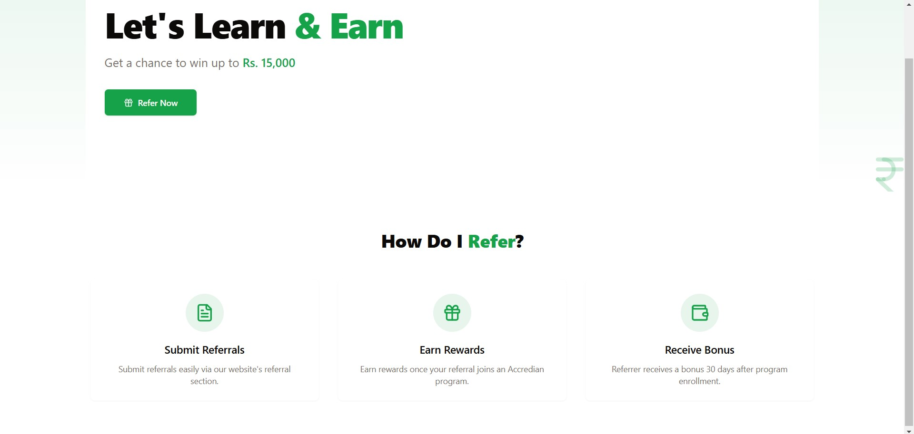
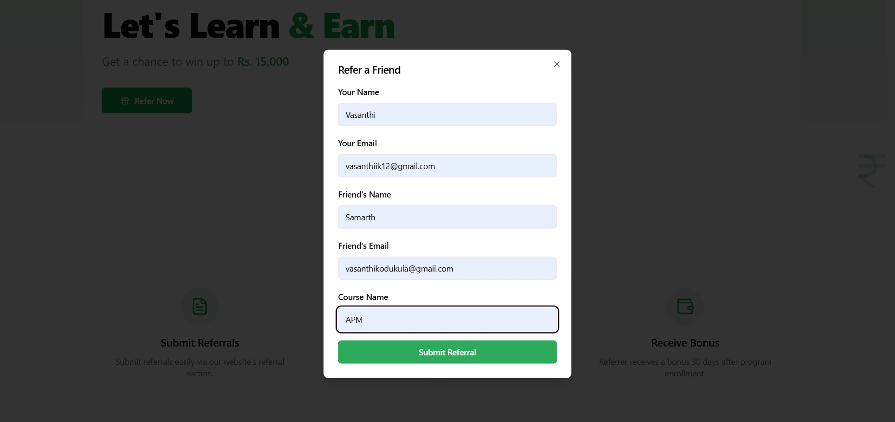
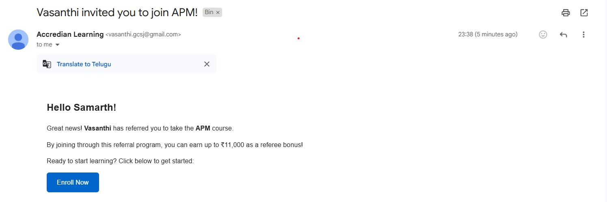

# Accredian Frontend Task

A React-based frontend for the referral marketing platform.







## Setup Instructions

1. Clone the repository
2. Install dependencies:
```bash
npm install
```
3. Create a `.env` file based on `.env.sample`
4. Run the development server:
```bash
npm run dev
```
## Features
- Referral form with validation
- Beautiful UI with Tailwind CSS
- Real-time loading states
- Toast notifications

## Tech Stack
- React
- TypeScript
- Tailwind CSS
- React Query
- Vite
